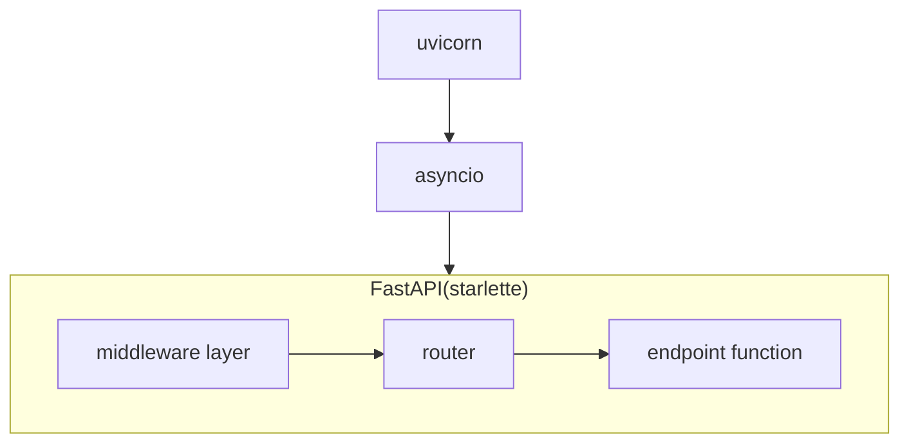

# FastAPI 따라가기

- [이 글](https://rumbarum.oopy.io/post/examine-fastapi-handling-request-line-by-line-with-comment)에 영향을 받아서 나도 해본다

# 목차

- Prerequisites
- 환경설정
- 앱 (1): 미들웨어 없는 호출
- 앱 (2): 미들웨어 타는 호출

# 개요

아래 내용을 따라가볼 예정:

아래 내용을 할 것입니다:

1. 디렉토리 만들기
2. Poetry 설정하기
    1. FastAPI, uvicorn 설치
3. 코드 짜기
4. 디버깅 🐛🐝

# Prerequisites

- `poetry`
- `>= python 3.9`

# 환경설정

- 디렉토리는 현재 클론한 이 디렉토리.
- poetry 설정은 `poetry install` 로 하자.
- 코드는 `app.py`, `app2.py` 를 사용함

# 앱 (1): 미들웨어 없는 호출 

- `app.py` 를 uvicorn 으로 구동.
- `root()` 안의 `return` 구문에 디버그 찍고 쫓아갑시다
    - 터미널에 `curl http://localhost:8000/api/hello-world` 입력 후...
    - ...스택 프레임을 타고가면 쫓아갈 수 있습니다.

## 분석 - `uvicorn`

1. `main`에서 `run` 을 호출, `Server()`는 `asyncio.run(self.serve(sockets=sockets))` 로 코루틴 객체 실행
    1. asyncio 안에선...
        1. 이벤트 루프를 부르고
        2. 이벤트 루프가 다 될때까지 기다린다
        3. 다 끝나면 `finally`를 타고 루프를 닫음 (`asyncio.run`은 1회용이니까)
            1. uvicorn의 main_loop 를 타고, 틱(on_tick)마다 쉰다
                1. 틱은 내부 카운터가 있는데, 하루에 1초씩 계속 끝낼지 물어본다.
                    - 여기서 `from email.utils import formatdate` 로 날짜값을 계산 후 date_header에 저장

## 분석 - `asgi`

1. 호출이 들어왔으니... asgi의 영역으로 들어감
    1. `uvicorn.protocols.http.httptools_impl` 내 `RequestResponseCycle.run_asgi()`
    2. `await app` 구문으로 [ASGI 표준](https://asgi.readthedocs.io/en/latest/specs/main.html#applications)에 맞게 scope, receive, send를 보냄
        1. 재밌는 점은, uvicorn의 app 내 `uvicorn.middleware.proxy_headers.ProxyHeadersMiddleware` 는 FastAPI app 을 바라보고있음
            1. 해당 클래스의 `__init__` 부분을 보기
            2. 그래서 app(`ASGI3Application`, ASGI 표준을 지키는 웹 애플리케이션)의 `__call__`은 결국 `FastAPI` 객체의 `__call__` 내의 `super().__call__` 을 호출한 것과 동일
            3. ...그런데 얘는 결국 Starlette의 `__call__` 을 호출한 것과 동일, 

## 분석 - `starlette` 과 `FastAPI`

1. `Starlette`의 build_middlware_stack을 통해 아래 순서로 미들웨어를 더한다
    1. `ServerErrorMiddleware`
    2. 나머지 유저의 미들웨어들 (`List`) 로 추가. immutable한 정의를 위해, 내 미들웨어를 tuple로 전달했던게 되던 이유가 보임
        1. middleware 객체가 tuple로 받고있어서, 리스트 + 튜플 + 리스트 해도 되나봄
    3. `ExceptionMiddleware`

### 미들웨어

1. 가장 먼저 `ServerErrorMiddleware`를 탄다 (starlette)
     1. `__call__` 객체가 있으니 호출이 된다. (그렇게 코드간 계약을 맺어서?)
        1. try로 잘되면 ㅇㅋ
        2. 아무런 `Exception`이 잡히면(`except Exceptions as ex`)... 로그 찍음

(유저 미들웨어 영역????? - 검증 필요)

2. 유저 미들웨어가 없으면 `ExceptionMiddleware`를 탄다 (starlette)

3. 두번째로 추측되는 `AsyncExitStackMiddleware`를 탄다 (fastapi)
4. 세번째로 추측되는 `Router`를 탄다 (fastapi)
    1. 얘는 Starlette의 routing.Route.handle() 을 탄다 - 내가 쓰기로 한 Route의 handle을 쓰는 듯? (분기에 보니까 ws, 등이 있던걸로 보아)

## API 콜 - 들어오면

1. 이거까지 되면 `starlette.routing.request_response` 를 콜...
    1. 시그니처가 (`func(request) -> Response`) 형태인 함수/코루틴을 await 한다
2. 그 안에 들어가면 `fastapi.routing` 의 `get_request_handler()` 를 콜한다
    1. 거기서 run_endpoint_function을 await 함
3. `fastapi.routing` 의 `run_endpoint_function()` 은...
    1. 코루틴이면 dependant.call() 을 여기서 함
    2. 아니면 스레드풀에서 돌리게 시킴 (`starlette.concurrency`)
    참고) 의존성 호출은 여기서!
4. 그제야 API 로직을 탐

## API 콜 - 나가면

1. `request_response()` 내의 await 를 통해 나가고
    1. `get_response_handler()` 에서 응답값을 serialize 하고 리턴
2. handle 쪽 await
3. `Router` 쪽 await
4. `AsyncExitStackMiddleware` 쪽 await
5. 그리고 리턴.

# 앱 (2): 미들웨어 타는 호출 

- `app2.py` 를 uvicorn 으로 구동.
- `root()` 안의 `return` 구문에 디버그 찍고 쫓아갑시다
    - 터미널에 `curl http://localhost:8000/api/hello-world` 입력 후...
    - ...스택 프레임을 타고가면 쫓아갈 수 있습니다.
